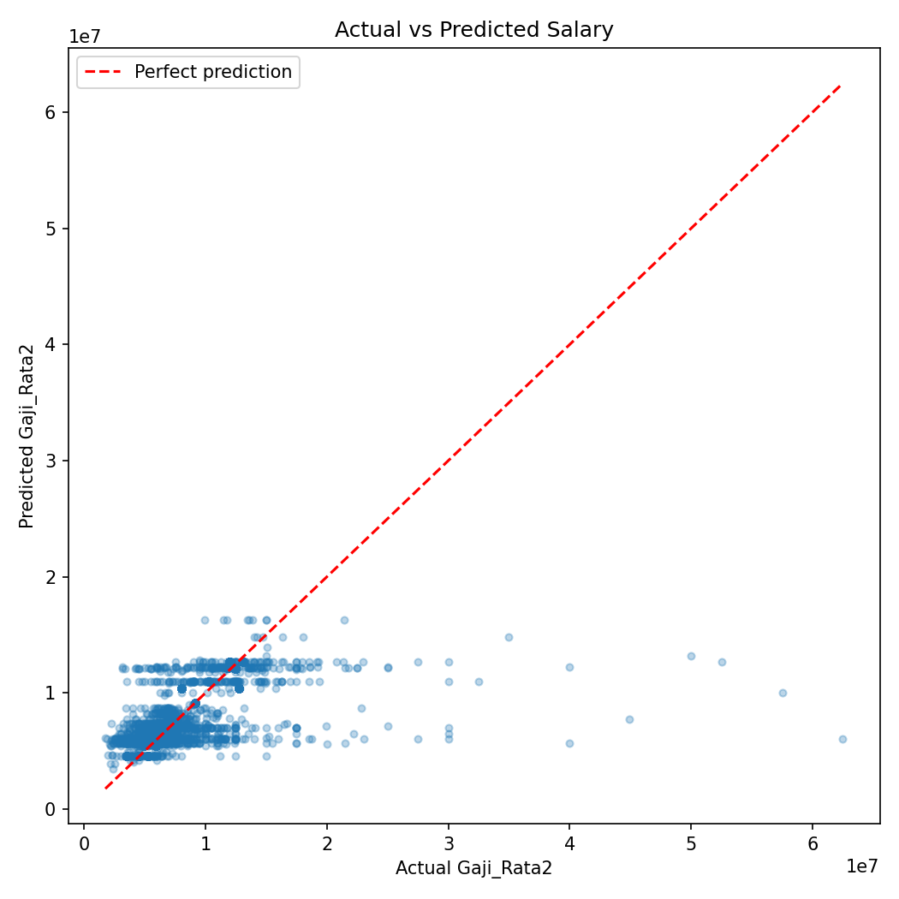
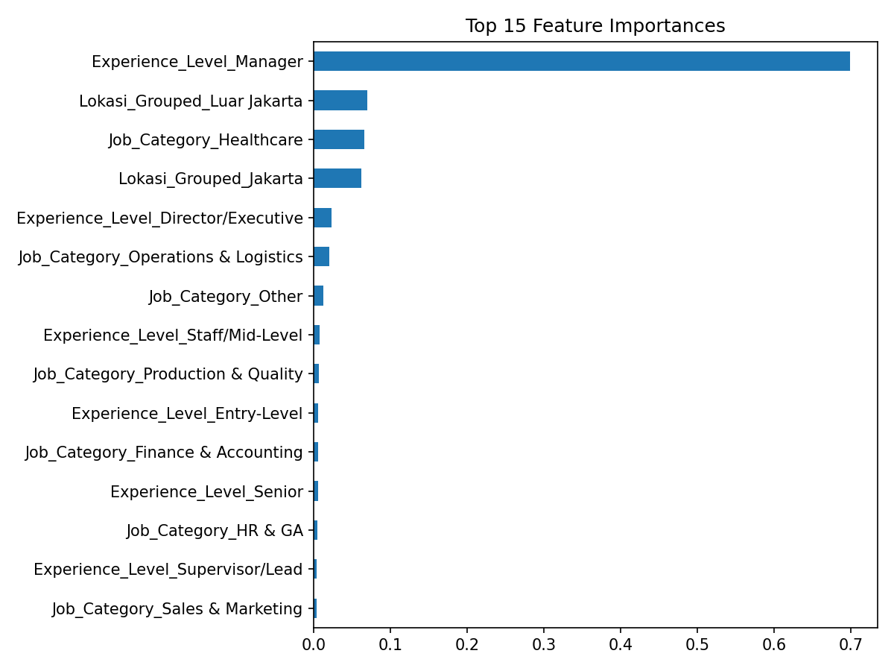

# Indonesian Job Salary Prediction & Feature Engineering Pipeline


> An end-to-end ML pipeline that turns **unstructured job listing text** into a salary predictor built to solve a real gap in Indonesia's labor market: no standardized job titles, no public salary benchmarks.

**Author:** Dimas Raditya Putra Handoko — *Data Analyst / Junior Data Scientist*
[GitHub](https://github.com/Dimxshan) · [LinkedIn](#) · [Portfolio](#)

---

## 📌 Overview

Salary transparency is a persistent problem in the Indonesian job market. Unlike markets where compensation bands are publicly benchmarked, Indonesian job postings are inconsistent — the same role can appear under hundreds of different, non-standardized titles, and location strings vary across 600+ variants of the same city. This makes it hard for **HR teams to budget hiring** and for **candidates to negotiate fairly**.

This project builds a fully reproducible pipeline that:
1. Extracts hidden structure from raw job title text using rule-based NLP (regex + keyword matching)
2. Encodes that structure into model-ready features
3. Trains a **Random Forest Regressor** to predict average salary (`Gaji_Rata2`) from data that originally had *zero* usable structured features

**Dataset:** 32,976 real Indonesian job listings (`Judul Pekerjaan`, `Perusahaan`, `Lokasi`, `Gaji_Rata2`)

---

## 🧠 Pipeline Architecture

```
Raw Text (Judul Pekerjaan, Lokasi)
        │
        ▼
┌───────────────────────────────┐
│  1. Rule-Based Feature         │   regex + keyword matching
│     Extraction                 │
│     • Experience_Level         │
│     • Job_Category             │
├───────────────────────────────┤
│  2. Geographic Grouping        │   Lokasi → Jakarta / Luar Jakarta
├───────────────────────────────┤
│  3. One-Hot Encoding           │   pd.get_dummies()
├───────────────────────────────┤
│  4. Random Forest Regressor    │   train/test split → fit → evaluate
└───────────────────────────────┘
        │
        ▼
   Predicted Gaji_Rata2
```

### 1️⃣ Experience_Level extraction
Titles are scanned for seniority keywords in priority order (highest tier wins when multiple keywords appear), producing six tiers:

| Tier | Example keywords |
|---|---|
| Director/Executive | `director`, `chief`, `vp`, `ceo` |
| Manager | `manager`, `manajer` |
| Supervisor/Lead | `supervisor`, `spv`, `team leader`, `kepala`, `coordinator` |
| Senior | `senior`, `sr` |
| Entry-Level | `junior`, `trainee`, `intern`, `magang` |
| Staff/Mid-Level | *(default)* |

### 2️⃣ Job_Category extraction
Titles are matched against a keyword dictionary spanning 9 functional areas: **Sales & Marketing, Finance & Accounting, HR & GA, Customer Service, IT & Digital, Operations & Logistics, Healthcare, Production & Quality, Creative & Design.**

### 3️⃣ Geographic grouping
600+ raw location strings are collapsed into **Jakarta vs. Luar Jakarta** to let the model learn the regional minimum-wage (UMR) gap directly.

---

## 📊 Results

| Metric | Score |
|---|---|
| **MAE** | Rp 1,035,518 |
| **R²** | 0.531 |

<p align="center">
  
  
</p>

**Reading the results:** the model tracks well through the mid-salary range but plateaus for high-salary outliers (Rp 20M+) — expected, since job title and location text alone can't capture company-specific pay scales or unlisted seniority signals. `Job_Category` and `Experience_Level` dominate feature importance, confirming the engineered features — not location — carry most of the predictive signal.

**Known limitation:** ~25% of titles fall into a catch-all `Other` category where the keyword rules don't have a confident match (e.g. "Corporate Communication Supervisor"). This is an honest trade-off of a rule-based approach on messy, real-world text and the clearest next step for improvement (see below).

---

## 🛠️ Tech Stack

| Category | Tools |
|---|---|
| Language | Python 3.12+ |
| Data Processing | `pandas`, `numpy`, `re` |
| Machine Learning | `scikit-learn` (RandomForestRegressor, train_test_split, metrics) |
| Visualization | `matplotlib`, `seaborn` |
| Environment | Jupyter Notebook |

---

## 🚀 Getting Started

```bash
# 1. Clone the repository
git clone https://github.com/Dimxshan/employee-salary-prediction.git
cd employee-salary-prediction

# 2. (Recommended) create a virtual environment
python -m venv venv
source venv/bin/activate      # Windows: venv\Scripts\activate

# 3. Install dependencies
pip install -r requirements.txt

# 4. Launch the notebook
jupyter notebook salary_prediction.ipynb
```

---

## 📁 Repository Structure

```
employee-salary-prediction/
├── salary_prediction.ipynb      # Full pipeline: EDA → feature engineering → model → evaluation
├── job_salary_mean.csv          # Raw dataset (32,976 job listings)
├── assets/                      # Result plots used in this README
│   ├── actual_vs_predicted.png
│   └── feature_importance.png
├── requirements.txt
└── README.md
```

---

## 🔮 Future Improvements

- Replace rule-based `Job_Category` extraction with a lightweight text embedding (e.g. TF-IDF + clustering) to shrink the `Other` bucket
- Benchmark against `XGBoost` / `LightGBM` for comparison against Random Forest
- Add `Perusahaan` (company) as a target-encoded feature instead of dropping it outright
- Deploy as a simple Streamlit app for interactive salary estimation

---
---

<p align="center">
  <i>If this project is useful to you, consider leaving a ⭐ on the repo.</i>
</p>
